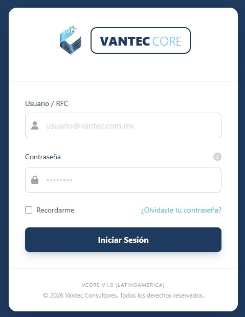
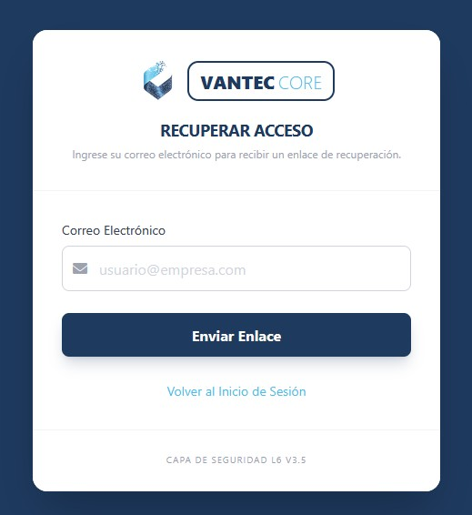
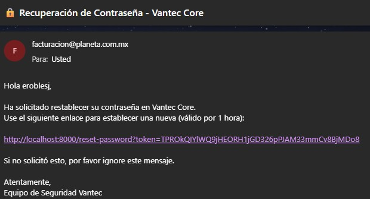
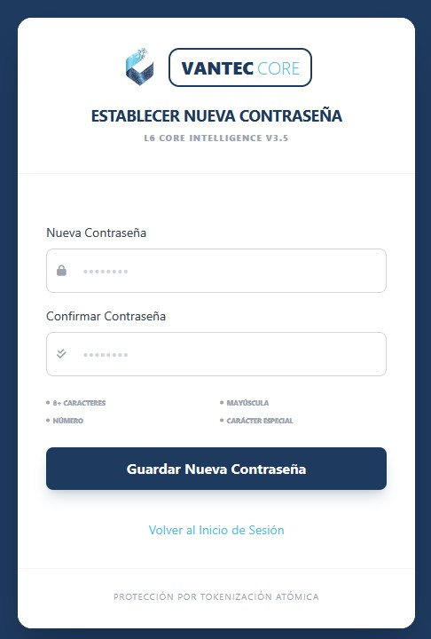
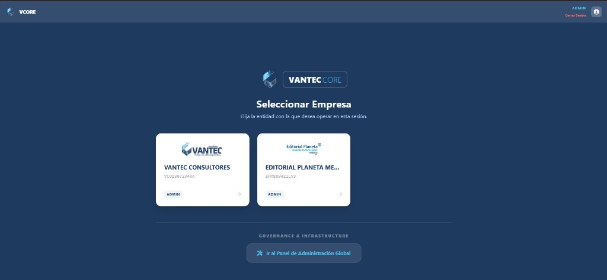
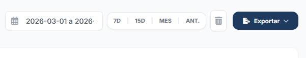
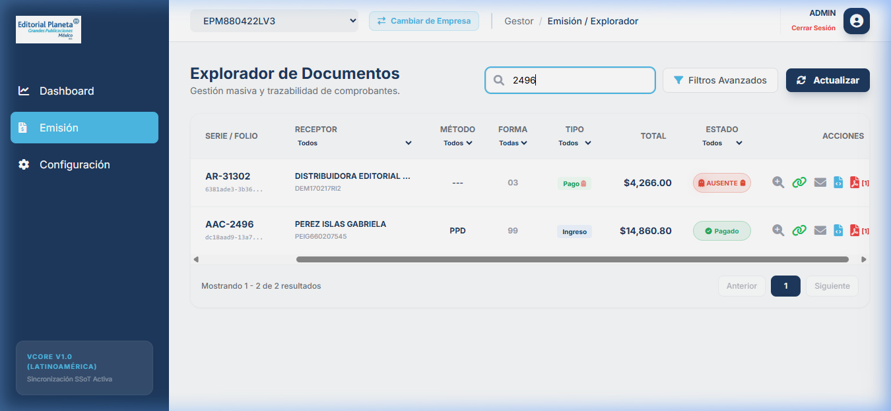
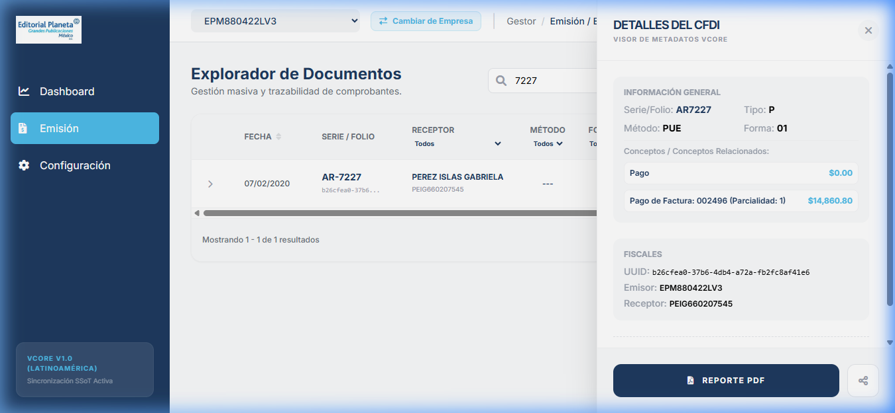
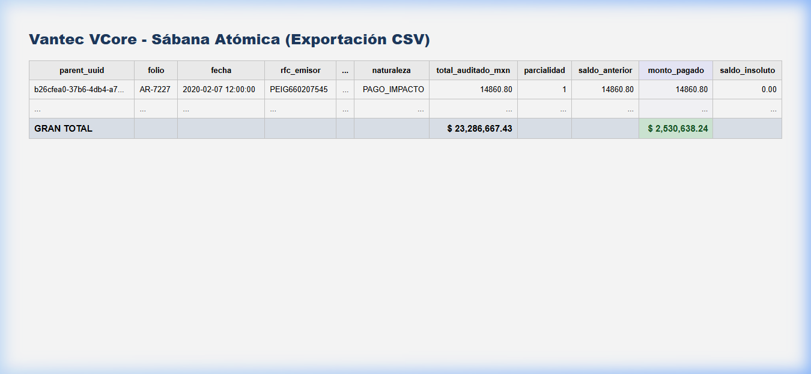

# 📘 PILAR 1: MANUAL DEL COMANDANTE (VCore v5.0.0)

Bienvenido al centro de mando de VCore. Este manual ha sido diseñado para que usted domine el sistema garantizando el control total de sus activos fiscales con precisión algorítmica.

## 🔐 PASO 1: El Acceso al Búnker
Para entrar al sistema, abra su navegador y escriba la dirección oficial. Verá una pantalla de acceso limpia y protegida por protocolos de encriptación avanzados.

**Instrucciones:**
* Ingrese su Usuario (RFC) y Contraseña.
* Haga clic en **Iniciar Sesión**.

### 🛡️ PASO 1.1: Protocolo de Recuperación de Acceso
Si ha extraviado sus credenciales, VCore despliega un puente seguro de validación institucional. La seguridad es atómica: el enlace de recuperación tiene una **vigencia estricta de 60 minutos**.

1.  **Solicitud:** Seleccione **"¿Olvidaste tu contraseña?"**.
2.  **Validación:** Ingrese su correo oficial para recibir un **Token Atómico**.
3.  **Restablecimiento:** Defina su nueva clave bajo el estándar de seguridad (Mínimo 8 caracteres, Mayúscula, Número y Especial).

## 🌐 PASO 1.5: Selección de Inteligencia (Multiempresa)
Tras validar sus credenciales, VCore despliega el **Centro de Mando Federado**. Aquí, el Comandante no está limitado a una sola entidad; puede alternar entre las diferentes empresas del grupo desde el selector superior.

* **Acción:** Seleccione la entidad fiscal que desea auditar en la sesión actual.
* **Resultado:** El sistema realiza una conmutación atómica de datos, cargando el Dashboard específico de la empresa elegida.

## 🏢 PASO 2: Dashboard e Inteligencia de Tiempos
El Dashboard de VCore permite una auditoría veloz mediante filtros de temporalidad simplificados:

* **7D / 15D / MES / ANT:** Filtre la operación de la última semana, quincena o meses específicos con un solo clic.
* **Directiva de Descarga Segura:** Si no se aplica un filtro manual, el sistema extraerá por defecto los **últimos 6 meses de operación** para garantizar una visibilidad histórica completa.

## 📜 PASO 3: Auditoría y Verificación de Integridad SSoT
El sistema blinda contra duplicidad real (v5.0). Observará que cada documento (como la factura AAC-2496) reporta un indicador perfecto de trazabilidad.

Al solicitar la descarga de un pago relacionado (AR-7227), el motor renderiza la cifra verificada y limpia de forma atómica.

## 📜 PASO 4: La Sábana de Oro (Reportes Maestros)
Para extraer toda la información y realizar conciliaciones contra su banco, utilice el **Reporte Maestro (CSV)**.

> [!NOTE]
> El estándar CSV de VCore permite una integración inmediata con Excel, donde el usuario puede aplicar estilos y filtros para auditorías de alto nivel.

