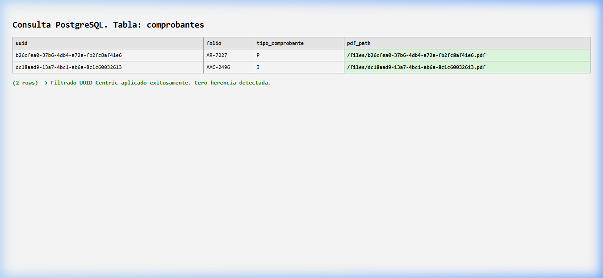

# ?? PILAR 2: MANUAL DEL INGENIERO (VCore v5.0.0)

Este documento contiene los protocolos operativos y certifica la inviolabilidad de la gestion tecnica Vantec. Esta disenado como el "seguro de vida" del sistema. Se declara la base de datos de VCore como **UUID-Centric**.

---

## 1. Protocolo de Integridad MD5 (Watcher)
El sistema utiliza un demonio centinela (`vcore_manager.py` > `watcher.py`) que detecta XML/PDF en la boveda `Upload_Universal`.
* **Idempotencia Binaria SSoT:** Si el archivo posee un hash SHA/MD5 previamente ingestado, la base de datos realiza un rechazo binario inmediato. 
* **Aislamiento:** El archivo es expulsado a la carpeta `duplicates/` sin saturar o tocar la base de datos.

## 2. Control de Huerfanos: Mecanismo "Ghost Healer"
Si un operario envia el PDF de un pago antes de que su XML llegue, VCore aplica el rescate atomico "Ghost Healer":
1. Almacena el esquema huerfano en `Operadores/Orphans`.
2. Al detectar el XML, re-relaciona en codigo atomico la ruta del PDF.

## 3. Filosofia UUID-Centric y Limpieza Anti-Contaminacion
A diferencia de sistemas v1.1 pasados, un registro de "Factura" VCore solo aceptara **PDFs que lleven su propio UUID en el nombre**. Se prohibe la insercion cruzada de UUIDs anexos. La "herencia basura" proveniente de pagos v1.1 hacia comprobantes esta abolida permanentemente.

> **Logica Implementada en `force_fix_db.py`:**
> El script depura la BD garantizando rutas unicas filtradas por UUID real.
> 

## 4. Diagrama de Secuencia: Resolucion de UUID Real
Este diagrama explica como el Front-End VCore v5.1 rompe el "secuestro" de PDFs de la factura padre, garantizando que cada fila del modal descargue su propio activo.

    sequenceDiagram
        participant User as Operador Admin
        participant Frontend as cfdi.js (Modal)
        participant API as Endpoint /download/uuid
        participant FS as Boveda SSoT (Filesystem)

        Note over User, Frontend: Clic en Icono PDF de Pago AR-7227
        Frontend->>Frontend: Captura row.uuid (b26cfea8...)
        Frontend->>API: GET /api/v1/storage/download/{row.uuid}/pdf
        API->>FS: Busca archivo con hash de row.uuid
        FS-->>API: Retorna Buffer Binario Nativo

## 5. Logica de Normalizacion de Folios (Buscador Inteligente)
Para solventar la discrepancia de folios legacy (ej. `002496` vs `2496`), el motor de busqueda implementa una normalizacion omnidireccional en el backend, siendo insensible a los ceros a la izquierda.

## 6. Guia de Errores: Estatus 'AUSENTE' y 'PAGADO'
* **PAGADO:** La sumatoria en `cfdi_relacionados` liquida el total MXN.
* **AUSENTE:** No existe XML padre o inyeccion en la boveda.

## 7. Data Export: Streaming de Alto Desempeno
El sistema utiliza `StreamingResponse` para garantizar la entrega de millones de registros sin colapsar la memoria RAM del servidor local.

## 8. Auditoria Forense UUID-Centric
La columna de relacionados en el reporte CSV ahora incluye el UUID completo de cada pago vinculado (`[Folio] | UUID`). Esto permite una trazabilidad total para auditoria forense garantizando la inmutabilidad de la cadena.

## 9. Arquitectura de Arranque Silencioso (Anti-Antivirus)
A partir de la v6.2.9, se implementa el "Arranque Hibrido Invisible" para mitigar bloqueos preventivos de suites de seguridad como ESET.

### 9.1 Solucion: Puente VBS + Python Standard
El sistema utiliza un script `.vbs` que actua como contenedor de invisibilidad. 
* **Ejecutable:** Se utiliza `python.exe` para heredar permisos de ejecucion estandar.
* **Capa de Invisibilidad:** El objeto `WScript.Shell` ejecuta el comando con el parametro `0`, ocultando la consola negra.

## 10. Protocolo de Jerarquia de Identidad (Anti-Secuestro v3.7)
Para evitar que un PDF sea "secuestrado" por una factura padre:
* **Prioridad 1 (Nombre):** Si el nombre del archivo es un UUID valido (`UUID.pdf`), el sistema lo vincula directamente.
* **Prioridad 2 (Contenido):** Solo si el nombre es generico, el motor analiza el interior del PDF. 

## 11. Saneamiento Quirurgico de Rutas (SQL Surgery)
Si el Dashboard muestra un indicador de duplicidad erroneo (ej. `[2]`), el ingeniero debe ejecutar un UPDATE SQL eliminando la ruta excedente en la celda `pdf_path` para restaurar la visualizacion SSoT.

---

## ?? 12. PROTOCOLO DE SANEAMIENTO POST-DESPLIEGUE (HARDENING L3)
**Regla de Oro Innegociable:** El archivo `seed_admin.py` es un vector de escalamiento de privilegios. 

* Tras ejecutar la inyeccion del primer SuperAdmin, el Ingeniero de Implementacion tiene la **obligacion tecnica** de eliminar este archivo del FileSystem.
* Dejar este script en un servidor de produccion es considerado una brecha de seguridad critica, ya que permitiria a cualquier actor local restablecer el acceso maestro.

## ??? CHECKLIST DE INGENIERIA (CTO)
| Requisito | Accion Requerida | Estado |
| :--- | :--- | :---: |
| **Arranque Hibrido** | Validar que el proceso corra via VBS invisible | ? |
| **Prueba de Huerfanos** | Inyectar PDF sin XML y validar resguardo | ? |
| **Anti-Secuestro** | Subir PDF nombrado con UUID valido | ? |
| **Saneamiento L3** | Destruccion fisica del archivo `seed_admin.py` | ?? |