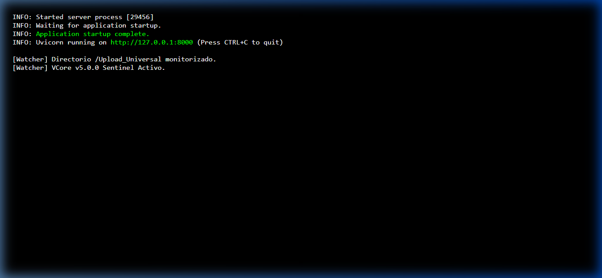
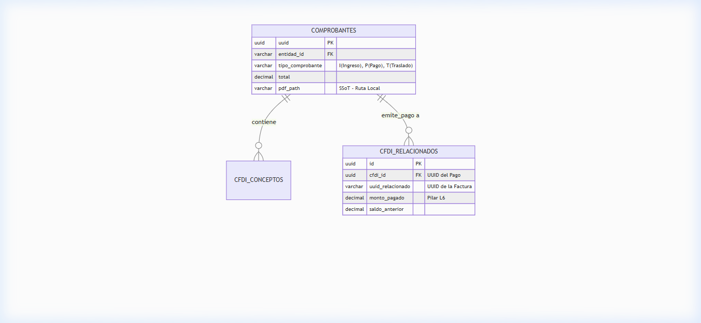
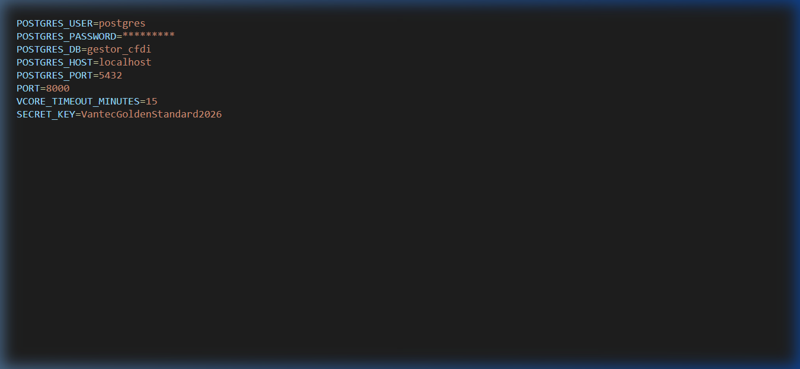
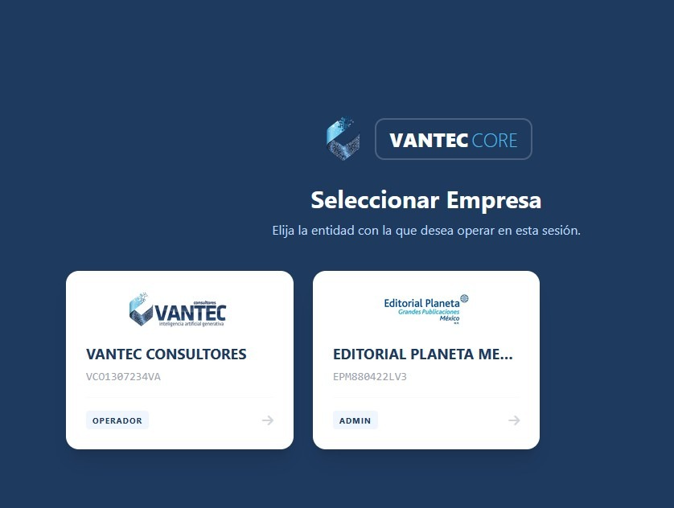

# ?? PILAR 3: MANUAL DE DESPLIEGUE Y ARQUITECTURA (VCore v5.0.0)

Este documento reemplaza a los antiguos manuales tecnicos y de instalacion. Es la base normativa para cualquier instalacion on-premise de VCore.

## 1. Requisitos Criticos de Infraestructura
* **Python Target:** Version Estricta `3.14.3` (Soporte completo de asincronismo en boveda atomica).
* **Port 8000 (SUCCESS):** El arranque debe limpiar dependencias y anclar a FastApi puro:


## 2. Diagrama de Relacion de Base de Datos
La integridad referencial sigue el Golden Standard Vantec, evitando inserciones "basura" en la subida heredada de la v1.1.


## 3. Sentinel y Boveda Criptografica (`.env`)
Configuracion SSoT y seguridad activa. No se tolera llave codificada en codigo.


**Seguridad Activa (Sentinel):**
Si el operador no interactua, la sesion expira drasticamente:


**Cirugia SQL (Seed Account):**
?? *HARDENING INDUSTRIAL:* Si se extravia el `ADMIN_ROOT_SEED` original configurado en el ciclo iterativo, o se dana la **Cuenta Maestra**, se debe usar el script de emergencia.
* **Protocolo de Blindaje Obligatorio:** Una vez inyectada la semilla mediante el script y validado el acceso, el archivo `seed_admin.py` **DEBE ser eliminado fisicamente** del servidor. Mantenerlo constituye una vulnerabilidad critica que permite el bypass de la jerarquia de roles y el acceso no autorizado a la base de datos de Tenants.

## 4. Gestion de Buffer y Exportacion
El sistema mantiene la carpeta `scripts/` libre de archivos temporales de exportacion. El sistema realiza una purga automatica del buffer de streaming para mantener la higiene del servidor. Solo se permiten scripts de produccion autorizados.

**Requisitos de Software:**
* **Framework:** FastAPI / Uvicorn.
* **Formatos:** Generacion nativa de CSV (SSoT Standard).
* **Limpieza:** Protocolo de purga activa en cada ciclo de exportacion.
* **Higiene de Boveda Atomica:** El Watcher v3.7.1 realiza una sanacion de base de datos en cada vinculacion, eliminando automaticamente del campo `pdf_path` aquellas rutas de archivos que ya no existan fisicamente en el servidor, garantizando que el Dashboard siempre refleje activos reales.

## 5. Auditoria del Blindaje L3 (Estado de Licencia)
El sistema opera bajo un reloj de arena inmutable (Hardware ID anclado al despliegue). Para auditar en cualquier momento cuantos dias de gracia le quedan al servidor antes del bloqueo de la Fase L3 (Dia 46), el Oficial de Despliegue debe ejecutar el siguiente comando de diagnostico en la terminal PowerShell dentro de la raiz del proyecto:

```powershell
$fecha = (Get-Item ".\src\license\machine_id.txt").CreationTime; $dias = (New-TimeSpan -Start $fecha -End (Get-Date)).Days; $restantes = 45 - $dias; Write-Host "`n?? ESTADO DE LICENCIA VCORE ??`n---------------------------`n?? Instalacion: $fecha`n? Dias transcurridos: $dias`n?? Dias restantes de gracia: $restantes`n"