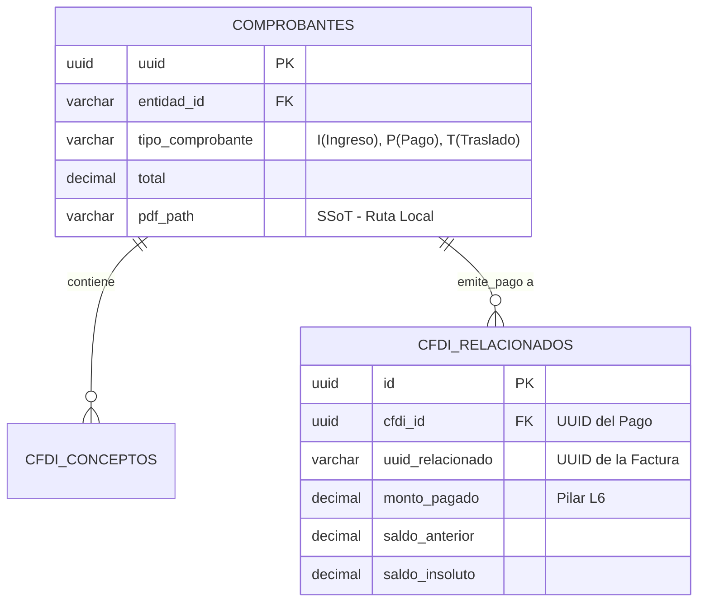

# 🏛️ PILAR 3: MANUAL DE ARQUITECTURA (Certificación Chile)

Este documento certifica las directivas de ingeniería base para el núcleo transaccional VCore. Está diseñado para ser la guía inmutable de la arquitectura SSoT (Single Source of Truth).

## 1. Esquema de Base de Datos y Cardinalidad

El sistema procesa transacciones bajo una arquitectura de "Extrapolación UUID". A continuación se muestra la representación jerárquica del comprobante fiscal (v3.3/v4.0) respecto a la capa L6 de pagos.



## 2. Portabilidad Universal y Variables de Entorno
VCore 5.0.0 aplica el "Golden Standard" de portabilidad.

**Directivas del `.env`:**
El despliegue local o de servidor restringe llaves hardcodeadas. El sistema arranca con:
```env
POSTGRES_USER=postgres
POSTGRES_PASSWORD=**********
POSTGRES_DB=gestor_cfdi
POSTGRES_HOST=localhost
POSTGRES_PORT=5432
PORT=8000
```
**Reglas SSoT para Bóveda Activos:** Ninguna ruta de assets puede contener base64, se exige apuntar de modo relativo. Ejemplo estricto: `../../assets/docs_manuals/NombreImagen.jpg`.

## 3. Lógica Financiera L6 (Sábana Atómica)
Para que el reporte exportable coincida íntegramente con los depósitos bancarios auditados (**Gran Total: $2,530,638.24**), el "Aplanamiento" del backend sigue un SQL UNION ALL donde:

1.  **Capa 1 (Ingresos/Egresos):** 
    Recupera el `con.importe` (Conceptos) como componente base, omitiendo en su suma total los pagos abstractos para no duplicar valor contable.
2.  **Capa 2 (Impacto Pagos L6):**
    Los CFDI tipo `P` mapean sus impactos reales a través de UUID relacionados.
    
```sql
-- Extracción Segura de Detalles (Directiva L6: Uso obligatorio de || en Postgrespg)
'Impacto en Factura: ' || rel.uuid_relacionado as detalle_linea,

-- Definición de Auditoría:
CAST(rel.num_parcialidad AS integer) as parcialidad,
rel.saldo_anterior as saldo_anterior,
rel.monto_pagado as monto_pagado,
rel.saldo_insoluto as saldo_insoluto
```

Cualquier desviación a este algoritmo de extracción romperá el reporte bancario de control.


