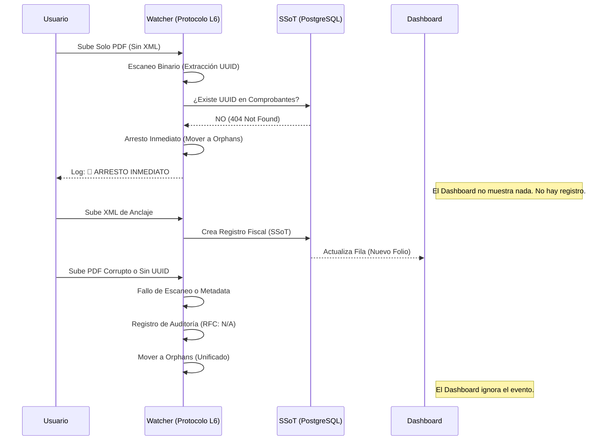

# 🛠️ Manual de Arquitectura Vantec VCore L6

Este documento detalla los componentes críticos de la infraestructura de ingesta y entrega de documentos de **VANTEC CORE V3.1**.

---

## 1. Lógica UUID-Centric (L6 Engine v3.1 - Total Vision)
Vantec VCore utiliza el motor **L6 Engine v3.1 (Total Vision)**, un sistema de extracción híbrido diseñado para garantizar un 100% de visibilidad fiscal en cualquier tipo de PDF (Ingresos, Egresos, Nóminas, Traslados).

### Motor de Análisis Híbrido:
1.  **Estrategia A (Estructural):** Utiliza la librería `pypdf` para descomprimir flujos `/FlateDecode` y extraer texto de todas las páginas del documento.
2.  **Estrategia B (Binaria/XMP):** Si los datos fiscales están incrustados en los metadatos (XMP) o en el tráiler del archivo (común en PDFs modernos optimizados), el sistema realiza un escaneo de bytes directo para capturar el UUID y el RFC.
3.  **Identificación de Genes Fiscales:**
    -   **Naturaleza FISCAL:** UUID y RFC detectados (Identidad Completa).
    -   **Naturaleza FISCAL_INCOMPLETE:** RFC detectado pero falta UUID (Daño estructural).
    -   **Naturaleza NO_FISCAL:** Sin identificadores tras análisis híbrido profundo (Residuo/No-Fiscal).

---

## 2. Arquitectura de Triaje Inteligente (Filtros de Seguridad)
El Watcher actúa como un auditor de dos niveles con una "Ventana de Gracia" de 30 segundos para garantizar la estabilidad en sistemas Windows.

### Nivel 1: Filtro Civil (Invalid_ADN)
Si un archivo es identificado como basura o no fiscal tras el escaneo profundo.
- **Destino:** `Operacion_CFDI/Invalid_ADN`
- **Motivo en Log:** `TIPO: NO_FISCAL | ACCIÓN: RECHAZO_TOTAL`

### Nivel 2: Filtro Fiscal (Orphans)
Si el archivo es un CFDI legítimo pero su Ancla XML no existe en la base de datos (SSoT).
- **Destino:** `Operacion_CFDI/Orphans`
- **Motivo en Log:** `TIPO: HUÉRFANO | UUID: [EXTRACTED] | ACCIÓN: ESPERA_XML`

---

## 2. Flujo de Rechazo y Ceguera del Dashboard
El Dashboard de VCore es **ciego** a cualquier archivo que no cuente con un respaldo XML (Ancla Fiscal). 

### Diagrama de Secuencia de Ingesta:



---

## 3. Glosario de Auditoría (Logs)
-   **RFC: N/A**: Indica que el sistema no pudo extraer el RFC emisor/receptor ni el UUID del archivo (Documento inválido o binario corrupto).
-   **ANCLAJE FISCAL**: Estado de una factura (XML) antes de recibir anexos logísticos.

---

## 2. Estrategia de Cache-Busting & Hardening
Para evitar el error crítico de "Descarga de 1KB" (causado por navegadores que sirven respuestas de error cacheadas), se implementó un sistema de **Invalidación Dinámica**.

-   **Backend:** Los endpoints de descarga en `comprobantes.py` emiten encabezados `Cache-Control: no-store, no-cache, must-revalidate`.
-   **Frontend:** Toda petición de descarga (`fetch`) desde `cfdis.js` concatena un parámetro dinámico `&_v=${Date.now()}`.
-   **Efecto:** El navegador se ve obligado a solicitar una copia fresca de la bóveda en cada clic, garantizando que el usuario siempre reciba el archivo de **+100KB**.

---

## 3. Diagrama de Flujo del Watcher (Decision Tree)

```mermaid
graph TD
    A[Archivo Detectado en Upload_Universal] --> B{¿Es XML?}
    B -- SÍ --> C[Parsear Metadatos CFDI]
    C --> D[Crear Registro en DB]
    D --> E[Buscar PDFs con Match Identitario]
    E --> F[Mover XML y PDFs a Bóveda]
    
    B -- NO --> G{¿Es PDF?}
    G -- SÍ --> H[Escaneo Binario por UUID]
    H --> I{¿Existe UUID en DB?}
    I -- SÍ --> J[Ligar a Factura Existente]
    J --> K[Mover PDF a Bóveda]
    I -- NO --> L[Esperar XML (60s)]
    L --> M{¿Llegó XML?}
    M -- SÍ --> C
    M -- NO --> N[Mover a Orphans]
    
    G -- NO --> O[Mover a Invalid_ADN]
```

---

## 5. Blindaje de Concurrencia (v3.3 Atomic Exclusive)
Para eliminar definitivamente los errores de colisión (**WinError 2**) y la duplicidad de funciones (**Bipolaridad**), se ha implementado un sistema de **Exclusión Mutua en Memoria**:

1.  **asyncio.Lock (ingestion_lock):** Garantiza que las operaciones de consulta y movimiento de archivos sean atómicas a nivel de hilo de ejecución.
2.  **Shared State (processing_files):** Un conjunto (`set`) dinámico que registra cada `file_path` en proceso. Cualquier intento posterior de procesar el mismo archivo (ya sea por evento `on_created` o por el ciclo `periodic_cleanup`) es abortado de inmediato si ya existe en el registro.
3.  **safe_process_file:** Orquestador único de seguridad que encapsula todo el ciclo de vida de la ingesta (Escaneo Híbrido -> Verificación DB -> Triaje).
4.  **Flujo de Bloqueo Atómico:**
    ```python
    async with ingestion_lock:
        if file_path in processing_files: return
        processing_files.add(file_path)
    try:
        # Lógica de Triaje L6 v3.3
    finally:
        async with ingestion_lock:
            processing_files.discard(file_path)
    ```
Este blindaje asegura que cada documento fiscal sea analizado y movido **una sola vez**, manteniendo la integridad del log de auditoría y la estabilidad del sistema operativo.
