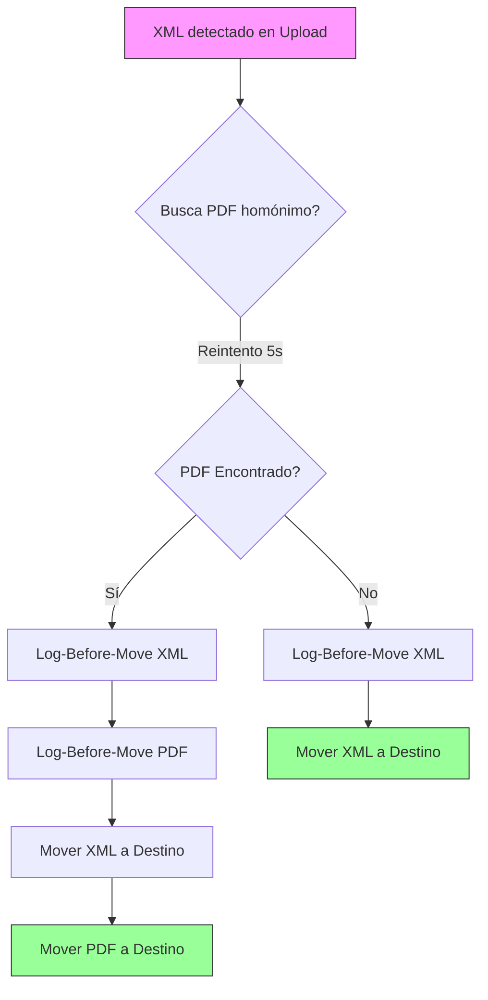

# Manual Técnico de Filesystem Vantec (L6 V2 Directive)

## 1. Arquitectura de Directorios y Lotes Diarios

El sistema implementa una política de **Rotación Diaria (Daily Batches)** para optimizar la eficiencia de auditoría y soporte.

| Carpeta | Descripción | Política de Permanencia |
| :--- | :--- | :--- |
| `Operacion_CFDI\Upload_Universal\` | Punto de entrada único. | **Cero Residuos** (Atómico) |
| `Operacion_CFDI\Orphans\` | Bóveda de archivos sin RFC registrado. | Permanente |
| `Operacion_CFDI\logs\` | Logs globales rotativos por día. | Permanente (Certificación L6) |
| `Operacion_CFDI\Files\[RFC]\logs\` | Logs de empresa rotativos por día. | Permanente (Auditoría) |

### Nomenclatura Oficial de Logs
- **Global**: `\logs\YYYY-MM-DD_watcher_global.log`
- **Empresa**: `\Files\[RFC]\logs\YYYY-MM-DD_empresa_audit.log`

## 2. Diagrama de Flujo: Ruteo Atómico de Pares (XML+PDF)

## 3. Matriz de Auditoría L6 V2

| Evento | Destino Log | Protocolo de Persistencia |
| :--- | :--- | :--- |
| Huérfano / Inválido | `YYYY-MM-DD_watcher_global.log` | `flush()` + `os.fsync()` |
| Duplicado / Fallo Er | `YYYY-MM-DD_empresa_audit.log` | `flush()` + `os.fsync()` |

> [!NOTE]
> El sistema implementa un **Bootstrap Cleanup** que purga automáticamente cualquier PDF residual abandonado en `Upload_Universal` al iniciar, garantizando el cumplimiento de la directriz de "Cero Residuos".

---
**Dirección Técnica Vantec | 2026**
